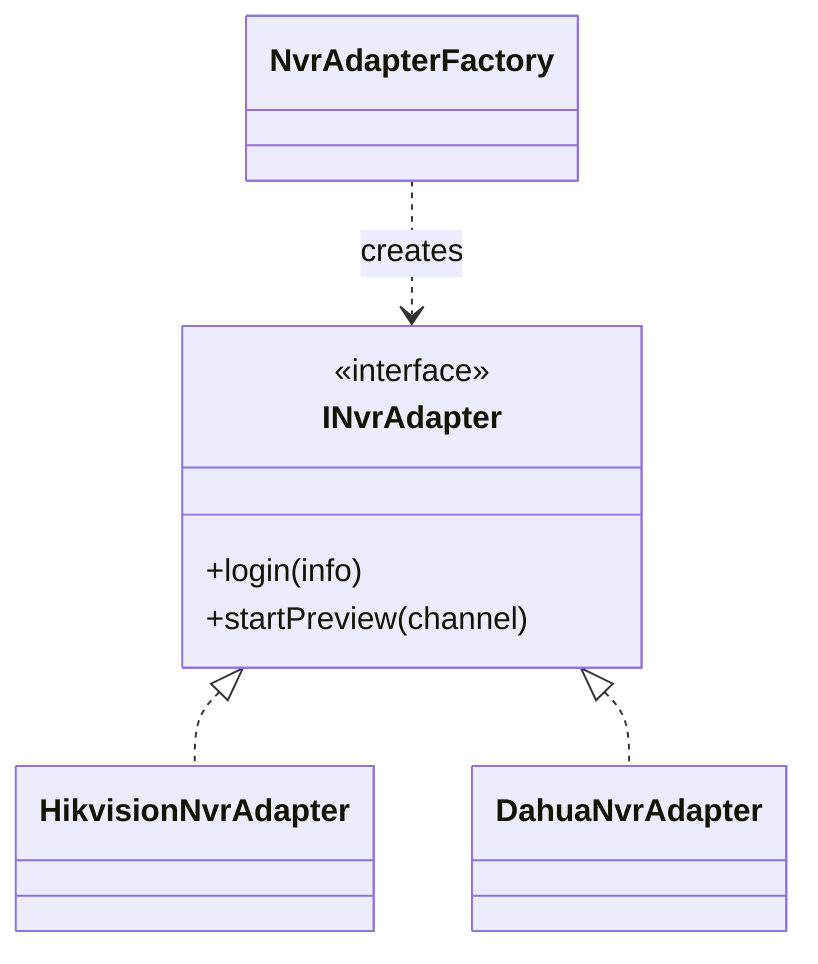

# Output Format Guide

Use the structure that matches the user's task. Keep answers practical and code-oriented.

## Pattern Recommendation

1. Problem summary
2. Decision score and whether the pattern is needed now
3. Recommended pattern
4. Why this pattern fits
5. Alternative patterns considered
6. Class design
7. C++/Qt implementation
8. Extension points
9. Local case used, if a `references/cases/*.md` article informed the answer
10. Risks and overengineering check

## Code Refactoring

1. Current code problem
2. Refactoring target
3. Selected pattern
4. Before/after structure
5. Safety checklist results
6. Step-by-step migration plan
7. Refactored code
8. Compatibility notes
9. Test plan

## Pattern Explanation

1. Intent
2. When to use
3. When not to use
4. Class structure
5. C++ example
6. Qt example when applicable
7. Local case mapping when applicable
8. Common mistakes

## Code Review

1. Whether a pattern is needed
2. Current coupling points
3. Extensibility issues
4. Recommended minimal change
5. Full pattern-based refactor if justified
6. Qt ownership/threading smells
7. Tests or logs needed before changing

## Architecture Design

1. Business variation points
2. Module boundaries
3. Pattern combination
4. Interface design
5. Mermaid class diagram when it clarifies relationships
6. Key code sketch
7. Future extension path
8. Overengineering check

## Real-Code Refactor Gate

Before proposing edits to existing C++/Qt files, summarize:

1. Existing behavior to preserve.
2. Ownership and thread-affinity assumptions.
3. Public API, signal/slot, or CMake changes.
4. Minimal migration step.
5. Characterization tests, QtTest/gtest tests, or logs needed.

If any assumption is unknown and risky, recommend a smaller preparatory change.

## Mermaid Class Diagram

Use Mermaid only when a diagram will clarify the answer. Keep diagrams compact and focused on the pattern boundary.

## Required Tone

- Be decisive once enough context is available.
- Say when no pattern is needed.
- Prefer minimal viable refactors.
- Explain tradeoffs in engineering terms: coupling, lifetime, testability, extension frequency, and runtime switching.

## Local Case Corpus

When the user asks for real cases, examples from the author's articles, or CSDN-inspired explanations:

1. Load `case-index.md`.
2. Load only the specific `references/cases/*.md` file needed.
3. Mention the local case file used.
4. Adapt the case to the user's C++/Qt ownership, threading, testing, and project structure.
5. Keep the anti-overengineering check even when the case demonstrates a pattern.
